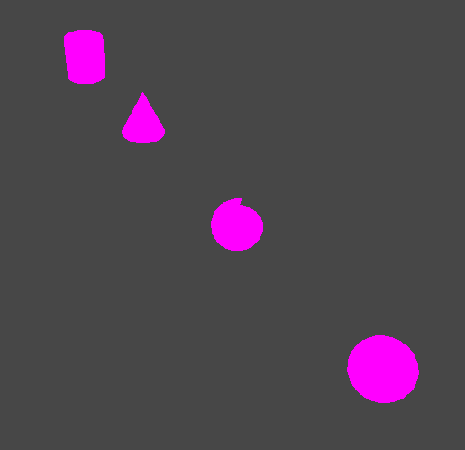
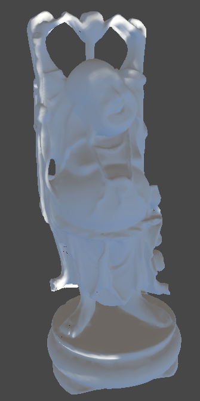
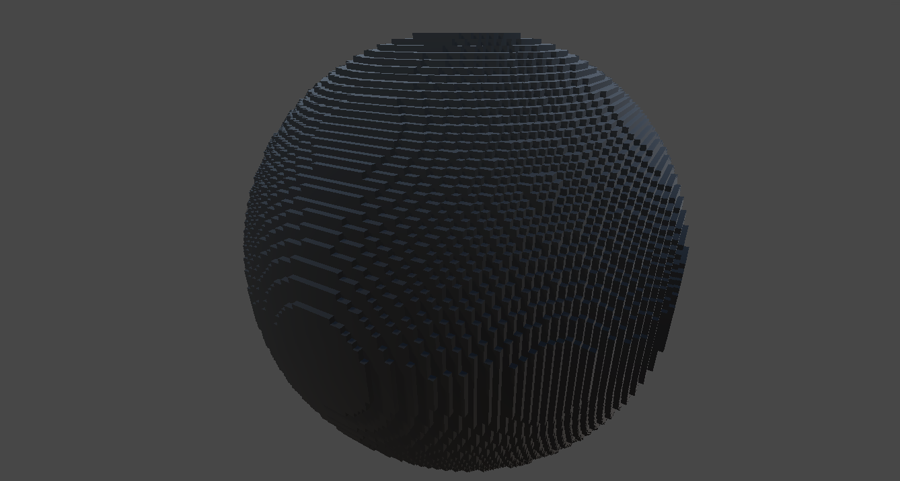
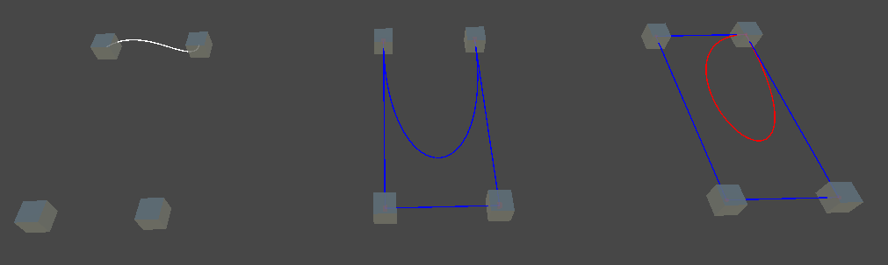

# Modélisation Géométrique

Ce document résume les différents TDs (1 à 6) portant sur des algorithmes et des implémentations liés à la géométrie et à la manipulation de maillages dans Unity.

---

## **TD 1 : Introduction aux Meshes**

**Objectif :** Comprendre les bases de la manipulation des maillages dans Unity.

- **Création de formes simples :**
  Implémentation d’un script permettant de créer un maillage à partir de points (sommets) et de triangles.
  
- **Points principaux :**
  - Définition des sommets (à l’aide de `Vector3`).
  - Définition des triangles (à l’aide d’un tableau d’indices).
  - Application du maillage à un `MeshFilter` pour le rendre visible.

---

## **TD 2 : Calculs de Normales**

**Objectif :** Implémenter le calcul des normales pour les maillages afin d’améliorer leur rendu.

- **Détails :**
  - Calcul des normales à partir des sommets et des triangles.
  - Normalisation des vecteurs normaux pour garantir leur unité.
  - Comparaison du rendu avec et sans calcul de normales.

**Capture d'écran suggérée :**
Une scène avec un maillage régulièrement ombré (grâce aux normales).

---

## **TD 3 : Division et Déformation des Meshes**

**Objectif :** Implémenter un algorithme de quadtree adaptatif pour la représentation volumétrique 3D de sphères en utilisant l'énumération spatiale.

- **Exercice :** Détermination de la boîte englobante minimale pour chaque sphère à partir de son **centre** et de son **rayon**, optimisant la détection des collisions et les requêtes spatiales.
- **Manipulations :**
  - Itération sur un ensemble de sphères pour générer des représentations individuelles.  
  - Approximation du volume de chaque sphère par des cubes, en calculant des intersections entre les cubes et la sphère pour des détails précis.
  - Division des cubes intersectant partiellement les sphères en cubes plus petits.
  - Vérification des intersections avec les sphères à chaque niveau de récursion pour améliorer la précision sans redondance.

**Capture d'écran suggérée :**
Un maillage avant et après subdivision, avec des différences visuelles claires.

---

## **TD 4 : Simplification par Partitionnement**

**Objectif :** Réduire le nombre de sommets d’un maillage en fusionnant ceux proches.

- **Méthode :**
  - Construction d’une grille pour regrouper les sommets proches.
  - Fusion des sommets dans chaque cellule en calculant leur moyenne.
  - Mise à jour des triangles avec les nouveaux indices des sommets fusionnés.

- **Paramètres :**
  - Taille de la cellule (contrôlant la résolution du maillage résultant).

---

## **TD 5 : Subdivision de Courbes**

### **Exercice 1 : Algorithme de Chaikin**

**Objectif :** Implémenter l’algorithme de Chaikin pour lisser une courbe.

- **Détails :**
  - À chaque itération, diviser chaque segment de la courbe en deux points calculés à 25 % et 75 % entre les extrémités.
  - Permet de générer une courbe lisse à partir d'un polygone grossier.

---

## **TD 6 : Courbes et Algorithmes Avancés**

### **Exercice 1 : Courbes d’Hermite**

**Objectif :** Tracer des courbes d’Hermite définies par deux points et leurs tangentes.

- **Points clés :**
  - Utilisation des coefficients Hermite pour interpoler une courbe.
  - Interaction possible pour ajuster les tangentes en temps réel.

### **Exercice 2 : Courbes de Bézier Cubiques**

**Objectif :** Implémenter les courbes de Bézier à l’aide de 4 points de contrôle.

- **Points clés :**
  - Calcul paramétrique utilisant les points de contrôle.
  - Visualisation des polygones de contrôle et des segments de la courbe.

### **Exercice 3 (Option) : Algorithme de Casteljau**

**Objectif :** Générer des courbes de Bézier à partir d’un nombre quelconque de points de contrôle.

- **Détails :**
  - Implémentation récursive de l’algorithme de Casteljau.
  - Permet de manipuler des courbes complexes avec des interactions dynamiques.

Screenshot dans l'ordre des courbe d'Hermite, Bézier et Casteljau

---

## **Conclusion**

Ces travaux dirigés offrent une introduction solide à la manipulation des maillages et des courbes dans Unity, en couvrant des concepts comme la subdivision, la simplification, et les courbes paramétriques.

**Suggestions :**
- Ajouter des animations pour visualiser les processus en temps réel.
- Exporter les courbes et maillages générés pour les utiliser dans d’autres projets.

**Prochaine étape :** Approfondir les shaders pour rendre les maillages encore plus réalistes.